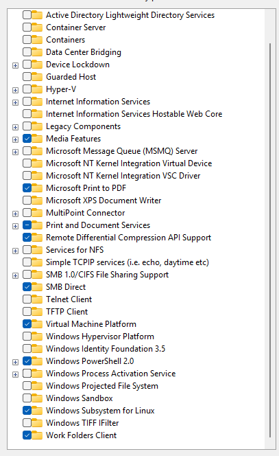

- If you are a macOS user please skip this
## Enable wsl
- Windows + features
- Uncheck Hyper-V
- Check Virtual Machine Platform
- Check Windows Subsystem for Linux



---

- Restart computer

## Install wsl distro
### Open powershell with administrator
```commandline
wsl --list --online
```

- Install oracle linux 8.7
```commandline
 wsl --install --distribution OracleLinux_8_7
``` Installation with logging
wsl --install --distribution OracleLinux_8_7 *>&1 | Tee-Object wsl_install.log
```
- Username: `train`
- Password: `Ankara06`

## Install Python 3.12
- Open Oracle Linux terminal
```
sudo dnf install python3.12.x86_64

sudo alternatives --config python
```
- Output
```
There are 3 programs which provide 'python'.

  Selection    Command
-----------------------------------------------
*+ 1           /usr/libexec/no-python
   2           /usr/bin/python3
   3           /usr/bin/python3.12

Enter to keep the current selection[+], or type selection number: 3
```

- Check version
```
python -V
```
- Output
```
Python 3.12.8
```