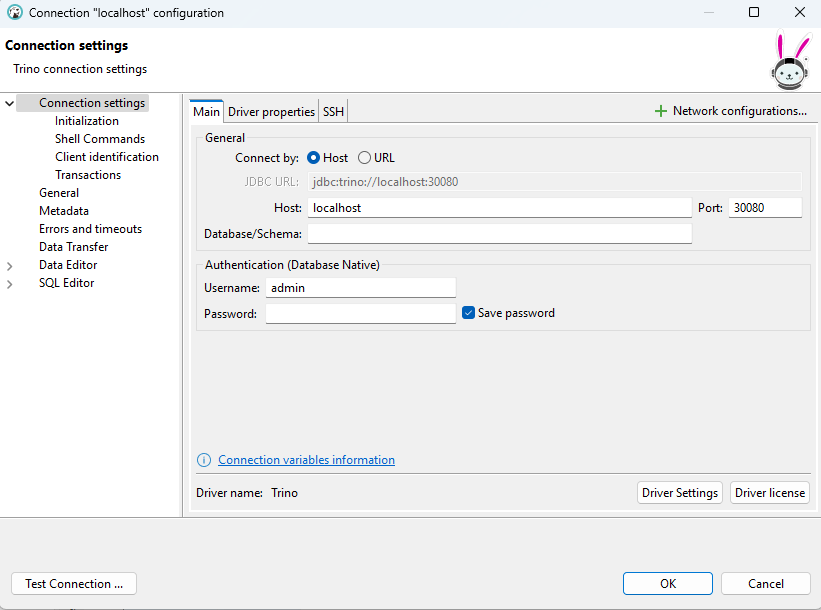

## 1. Helm chart
```commandline
kubectl create namespace trino

helm repo add trino https://trinodb.github.io/charts
helm repo update
```

## 2. Create postgresql database for analytical purposes
```commandline
kubectl exec -it cnpg-cluster-1 -n cnpg-database -- psql -U postgres

CREATE DATABASE traindb;
\c traindb;
CREATE USER train WITH PASSWORD 'Ankara06';
GRANT ALL PRIVILEGES ON database traindb TO train;
GRANT ALL PRIVILEGES ON SCHEMA public TO train;
```
## 4. Create access keys for connecting minio
- Open minio UI
- Access key: `a4PUfy09CWvLQ4sif2pB`
- Secret key: `EUIxGzupWlTXZiX6pRKH9FZse5sjSHIGGdMBnTOn`

## 5. Helm chart install
```commandline
 helm install trino trino/trino -n trino -f trino-values.yaml
```

## 6. Connect Trino



---

## 7. Trino UI
http://localhost:30080/ui/

- When asks username use `admin` there will be no password

## 8. Sample data and query on iceberg nessie
```sql
create schema iceberg.test;

CREATE TABLE iceberg.test.conversations (
    id INT,
    user_id INT NOT NULL, 
    team_id INT NOT NULL, 
    created_at TIMESTAMP
);
COMMENT ON TABLE iceberg.test.conversations IS 
'Collect together the users chats a bit like a history';

CREATE TABLE iceberg.test.chats (
    id INT, 
    conversation_id INT NOT NULL, 
    user_request VARCHAR NOT NULL, 
    prompt VARCHAR NOT NULL, 
    response VARCHAR, 
    created_at TIMESTAMP,
    updated_at TIMESTAMP
);

COMMENT ON TABLE iceberg.test.chats IS 
'Questions from the user and the response from the LLM';


INSERT INTO iceberg.test.conversations (id, user_id, team_id, created_at)
VALUES 
    (1, 101, 1001, TIMESTAMP '2024-10-08 12:00:00'),
    (2, 102, 1001, TIMESTAMP '2024-10-08 12:15:00'),
    (3, 103, 1002, TIMESTAMP '2024-10-08 12:30:00'),
    (4, 104, 1003, TIMESTAMP '2024-10-08 12:45:00'),
    (5, 105, 1001, TIMESTAMP '2024-10-08 13:00:00');


INSERT INTO iceberg.test.chats (id, conversation_id, user_request, prompt, response, created_at, updated_at)
VALUES 
    (1, 1, 'What is the capital of France?', 'Explain the capital of France', 'The capital of France is Paris.', TIMESTAMP '2024-10-08 12:01:00', TIMESTAMP '2024-10-08 12:01:10'),
    (2, 1, 'Tell me a joke', 'Share a funny joke', 'Why did the chicken join a band? Because it had the drumsticks!', TIMESTAMP '2024-10-08 12:02:00', TIMESTAMP '2024-10-08 12:02:05'),
    (3, 2, 'How do I cook pasta?', 'Instructions for cooking pasta', 'Boil water, add pasta, cook for 10-12 minutes.', TIMESTAMP '2024-10-08 12:16:00', TIMESTAMP '2024-10-08 12:16:20'),
    (4, 3, 'What is 2 + 2?', 'Calculate 2 + 2', '2 + 2 equals 4.', TIMESTAMP '2024-10-08 12:31:00', TIMESTAMP '2024-10-08 12:31:05'),
    (5, 4, 'How to start a garden?', 'Guide to starting a garden', 'First, choose a suitable location and prepare the soil.', TIMESTAMP '2024-10-08 12:46:00', TIMESTAMP '2024-10-08 12:46:30'),
    (6, 5, 'What are the best practices for coding?', 'Best coding practices', 'Keep your code clean, comment where necessary, and use version control.', TIMESTAMP '2024-10-08 13:01:00', TIMESTAMP '2024-10-08 13:01:20');


SELECT 
    c.id AS conversation_id,
    c.user_id,
    c.team_id,
    ch.id AS chat_id,
    ch.user_request,
    ch.prompt,
    ch.response,
    ch.created_at AS chat_created_at,
    ch.updated_at AS chat_updated_at
FROM 
    iceberg.test.conversations c
JOIN 
    iceberg.test.chats ch ON c.id = ch.conversation_id
WHERE 
    c.team_id = 1001
ORDER BY 
    ch.created_at ASC;
```

## 8. Sample data and query on postgresql
```sql
create schema postgresql.test;


CREATE TABLE postgresql.test.conversations (
    id INT,
    user_id INT NOT NULL, 
    team_id INT NOT NULL, 
    created_at TIMESTAMP
);

INSERT INTO postgresql.test.conversations (id, user_id, team_id, created_at)
VALUES 
    (1, 101, 1001, TIMESTAMP '2024-10-08 12:00:00'),
    (2, 102, 1001, TIMESTAMP '2024-10-08 12:15:00'),
    (3, 103, 1002, TIMESTAMP '2024-10-08 12:30:00'),
    (4, 104, 1003, TIMESTAMP '2024-10-08 12:45:00'),
    (5, 105, 1001, TIMESTAMP '2024-10-08 13:00:00');

CREATE TABLE postgresql.test.chats (
    id INT, 
    conversation_id INT NOT NULL, 
    user_request VARCHAR NOT NULL, 
    prompt VARCHAR NOT NULL, 
    response VARCHAR, 
    created_at TIMESTAMP,
    updated_at TIMESTAMP
);

INSERT INTO postgresql.test.chats (id, conversation_id, user_request, prompt, response, created_at, updated_at)
VALUES 
    (1, 1, 'What is the capital of France?', 'Explain the capital of France', 'The capital of France is Paris.', TIMESTAMP '2024-10-08 12:01:00', TIMESTAMP '2024-10-08 12:01:10'),
    (2, 1, 'Tell me a joke', 'Share a funny joke', 'Why did the chicken join a band? Because it had the drumsticks!', TIMESTAMP '2024-10-08 12:02:00', TIMESTAMP '2024-10-08 12:02:05'),
    (3, 2, 'How do I cook pasta?', 'Instructions for cooking pasta', 'Boil water, add pasta, cook for 10-12 minutes.', TIMESTAMP '2024-10-08 12:16:00', TIMESTAMP '2024-10-08 12:16:20'),
    (4, 3, 'What is 2 + 2?', 'Calculate 2 + 2', '2 + 2 equals 4.', TIMESTAMP '2024-10-08 12:31:00', TIMESTAMP '2024-10-08 12:31:05'),
    (5, 4, 'How to start a garden?', 'Guide to starting a garden', 'First, choose a suitable location and prepare the soil.', TIMESTAMP '2024-10-08 12:46:00', TIMESTAMP '2024-10-08 12:46:30'),
    (6, 5, 'What are the best practices for coding?', 'Best coding practices', 'Keep your code clean, comment where necessary, and use version control.', TIMESTAMP '2024-10-08 13:01:00', TIMESTAMP '2024-10-08 13:01:20');


SELECT 
    c.id AS conversation_id,
    c.user_id,
    c.team_id,
    ch.id AS chat_id,
    ch.user_request,
    ch.prompt,
    ch.response,
    ch.created_at AS chat_created_at,
    ch.updated_at AS chat_updated_at
FROM 
    iceberg.test.conversations c
JOIN 
    postgresql.test.chats ch ON c.id = ch.conversation_id
ORDER BY 
    ch.created_at ASC;
```